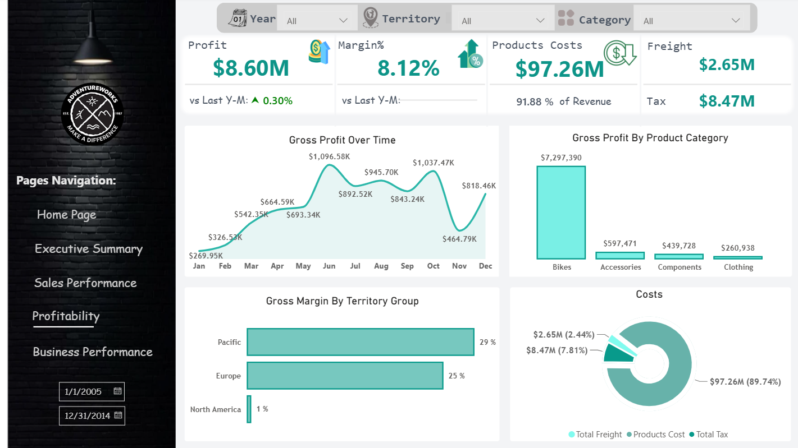

<div align="center">

# AdventureWorks Enterprise Analytics

### Enterprise Business Intelligence Solution built with Power BI, DAX & SQL Server
An enterprise-grade BI solution that delivers actionable insights for senior executive management. This project strictly follows modern data architecture by separating the **Centralized Semantic Model** from the **Reporting Layer** to ensure a single source of truth, high scalability, and optimized performance.


---


**Enterprise Executive Dashboard built on top of a centralized Semantic Model using AdventureWorks Data Warehouse.**

</div>

---

# Table of Contents

* [Project Overview](#project-overview)
* [Business Objectives](#business-objectives)
* [Solution Architecture](#solution-architecture)
* [Enterprise Semantic Model](#enterprise-semantic-model)
* [Executive Dashboard](#executive-dashboard)
* [Business KPIs](#business-kpis)
* [Interactive Features](#interactive-features)
* [Technology Stack](#technology-stack)
* [Repository Structure](#repository-structure)
* [Dashboard Gallery](#dashboard-gallery)
* [Project Highlights](#project-highlights)
* [Author](#author)

---

# Project Overview

AdventureWorks Enterprise Analytics is a complete Business Intelligence solution developed using **Power BI**, **DAX**, and **SQL Server**.

Unlike traditional Power BI reports, this project follows an enterprise architecture by separating the **Semantic Model** from the reporting layer, enabling centralized business logic, reusable measures, and scalable reporting.

The first delivered application is an **Executive Dashboard** designed for senior management to monitor company performance through high-level KPIs and interactive business visualizations.

---

# Business Objectives

✔ Monitor business performance

✔ Track Revenue & Profitability

✔ Analyze Territory Performance

✔ Compare Sales Channels

✔ Monitor Employee Performance

✔ Evaluate Product Categories

✔ Support Executive Decision Making

---

## 🗺️ Solution Architecture & Data Modeling
The project is built on top of the Microsoft **AdventureWorksDW**. It implements a robust **Star Schema** centered around **Conformed Dimensions** to eliminate fact-to-fact ambiguity and deliver sub-second query performance.

<p align="center">


</p>

---

# Enterprise Semantic Model

<p align="center">


</p>

### 📊 Enterprise Bus Matrix
| Dimension Table | FactInternetSales (B2C) | FactResellerSales (B2B) | FactSalesQuota (Targets) | FactCurrencyRate (Rates) |
| :--- | :---: | :---: | :---: | :---: |
| **DimDate** | ✅ Conformed | ✅ Conformed | ✅ Conformed | ✅ Conformed |
| **DimProduct** | ✅ Conformed | ✅ Conformed | ❌ N/A | ❌ N/A |
| **DimSalesTerritory** | ✅ Conformed | ✅ Conformed | ❌ Indirect | ❌ N/A |
| **DimEmployee** | ❌ N/A | ✅ Direct | ✅ Direct | ❌ N/A |
| **DimCustomer** | ✅ Direct | ❌ N/A | ❌ N/A | ❌ N/A |
| **DimReseller** | ❌ N/A | ✅ Direct | ❌ N/A | ❌ N/A |
| **DimPromotion** | ✅ Direct | ✅ Direct | ❌ N/A | ❌ N/A |
| **DimCurrency** | ✅ Conformed | ✅ Conformed | ❌ N/A | ✅ Conformed |

### Implemented Features

* Enterprise Galaxy Schema
* Shared Dimensions
* Centralized Business Logic
* Reusable DAX Measures
* Dynamic Currency Conversion
* Time Intelligence
* Enterprise Measure Organization
* Optimized Relationships

---

# Executive Dashboard

## Executive Summary

| Dashboard                                |
| ---------------------------------------- |
|  |

A high-end, light-minimalist analytical application structured to answer critical business questions in under 5 minutes using a strict top-down layout design.
* **Goal:** 30-second health check for C-Suite executives.
* **KPIs:** Total Revenue, Gross Profit, Gross Margin %, Total Orders (All with YoY Growth contexts).
* **Visuals:** Revenue & Profit Monthly Trend, Revenue Split (Internet vs Reseller), Regional Profitability Map, Product Category Growth Matrix.

---

## Sales Performance

| Dashboard                                |
| ---------------------------------------- |
|  |

* **Goal:** Granular breakdown of sales channels, volumes, and customer behavior.
* **KPIs:** Internet Sales, Reseller Sales, Average Order Value (AOV), Total Quantity.
* **Visuals:** Revenue Split Donut (with smart tooltips), Top 10 Products by Channel, Regional Revenue Treemap.

---

## Profitability

| Dashboard                            |
| ------------------------------------ |
|  |

* **Goal:** Trace where money is spent and detect margin drops.
* **KPIs:** Gross Profit, Gross Margin %, Total Cost, Freight & Tax Summary.
* **Visuals:** Revenue-to-Profit Waterfall Bridge, Margin vs Cost Line Combo, Product Subcategory Profitability Matrix (Scatter).

---

## Business Performance

| Dashboard                                   |
| ------------------------------------------- |
|  |

* **Goal:** Evaluate sales team efficiency against targets and track B2B performance.
* **KPIs:** Quota Achievement %, Target Variance, Active Employees, Active Resellers.
* **Visuals:** Actual Sales vs Quota Trend, Employee Target Achievement Ranking (Conditional Formatting), Promotion Contribution Funnel.
---

# Rsellers Sales Performance 'Tableau'

| Dashboard                                   |
| ------------------------------------------- |
|  |

* **Goal:** Monitor regional sales revenue and evaluate profitability trends to identify seasonal growth and margin drops.

* **KPIs:** Total Revenue ($34M), Gross Profit (-$429K), Average Order Value (AOV), Average Selling Price (ASP), Units Sold, and Orders.

* **Visuals:** KPI Cards with Sparkline Trends, Monthly Revenue vs Profit Bar Chart with Target-Average Line, and Dynamic Country-Level Slicers.


# Business KPIs

| Area          | KPIs                                     |
| ------------- | ---------------------------------------- |
| Revenue       | Revenue, AOV, ASP, Growth                |
| Profitability | Gross Profit, Margin, Cost, Freight, Tax |
| Orders        | Orders, Order Lines, Quantity            |
| Customer      | New, Returning, Retention                |
| Product       | Revenue, Profit, Margin, Product Mix     |
| Employee      | Revenue, Target, Achievement             |
| Territory     | Revenue, Profit, Growth                  |

---

## ⚡ Technical Highlights & Advanced DAX
* **Centralized Semantic Model:** Built using Thin Reports connected to a single published dataset via Live Connection.
* **Dynamic Currency Conversion:** Implemented dynamic translation utilizing `FactCurrencyRate` to handle local reseller pricing vs standard USD costs.
* **Time Intelligence Framework:** Custom DAX logic for `YoY Growth %`, `YTD`, and `Prior Year` calculations without breaking cross-filtering.
* **Strict Measure Organization:** Folder and Sub-folder structures managed via Tabular Editor for maximum scannability.

---

# Technology Stack

| Technology       | Description                   |
| ---------------- | ----------------------------- |
| **Power BI Desktop:**| Dashboard Development         |
|**SQL Server / T-SQL:**| AdventureWorks Data Warehouse |
| **DAX** | Business Logic                |
| **Power Query**     | Data Transformation           |
| **Git**              | Version Control               |
| **GitHub**           | Project Repository            |

---

# Repository Structure

```text
AdventureWorks-Enterprise-Analytics
│
├── Power-BI Semantic Model    #For unified Data, Business Logic
├── Project Presentation       #Showing Project Details And Flow
├── Reports                    #The Final Product After All These Discussion 
├── docs                       #Architecture details, Wireframes, and Bus Matrix
├── z_Images                   #Dashboards, System Flow and Architecture
└── README.md                  #Project Documentation
```

---

# Dashboard Gallery

| Executive Summary                        | Sales Performance                        |
| ---------------------------------------- | ---------------------------------------- |
|  |  |

| Profitability                        | Business Performance                        |
| ------------------------------------ | ------------------------------------------- |
|  |  |

---


# Author

## Ahmed Salah

**Business Intelligence Developer &
  Data Enginner**

Power BI • DAX • SQL Server • Data Modeling • Business Intelligence

---

<div align="center">

### ⭐ If you like this project, consider giving it a Star.

</div>
